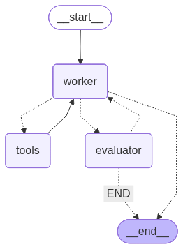

# Personal Coworker (LangGraph)

A multi-agent research assistant built with LangGraph and Gradio. This AI assistant pairs a tool-using worker with an evaluator that verifies outputs against user-defined success criteria, enabling inexpensive models (e.g., `gpt-4o-mini`) to deliver reliable, up-to-date answers.

## Features
- **Tool-augmented worker** for web browsing (Playwright), structured search (Google Serper + Wikipedia), Python execution, local file IO, and push notifications.
- **Evaluator loop** provides feedback on the worker's response; if criteria are unmet, the worker iterates or asks clarifying questions.
- **Stateful conversations** persisted via LangGraph checkpoints, with cleanup hooks for browser sessions.
- **Gradio UI** for chat-style interaction with optional success criteria input and reset handling.

## Agent Graph


## Architecture Highlights
- **LangGraph state machine** with `worker → (tools|evaluator)` routing and success/clarification gating before termination.
- **Tool harness** loads Playwright asynchronously, combines file management, search, Wikipedia, Python REPL, and Pushover notification utilities.
- **OpenAI models** bound to tools for the worker and structured output for the evaluator.

## Getting Started
1. **Install dependencies**
   ```bash
   uv sync
   ```
2. **Set environment variables** (e.g., via `.env`):
   - `OPENAI_API_KEY` (required)
   - `SERPER_API_KEY` for Google search
   - `PUSHOVER_TOKEN` and `PUSHOVER_USER` for notifications (optional)
3. **Run the UI**
   ```bash
   uv run app.py
   ```
4. **Use the chatbot**: enter a request and optional success criteria; the evaluator feedback is streamed as an additional message.

## Future Work
- Distribute tool usage across specialized agents instead of a single worker node.
- Integrate domain-specific toolkits for targeted use cases.
